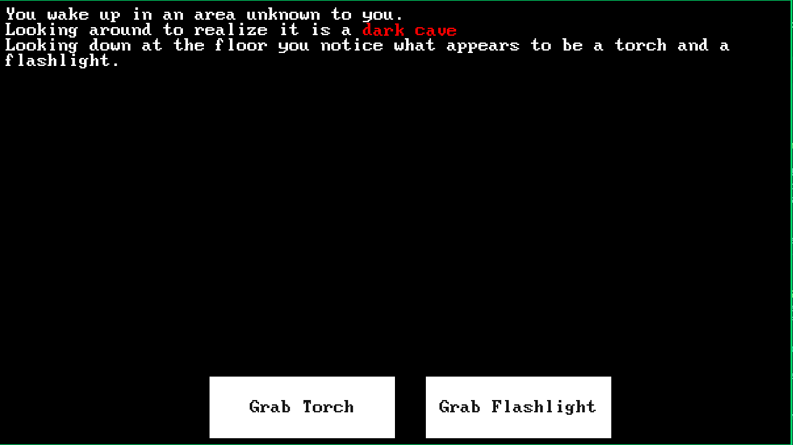
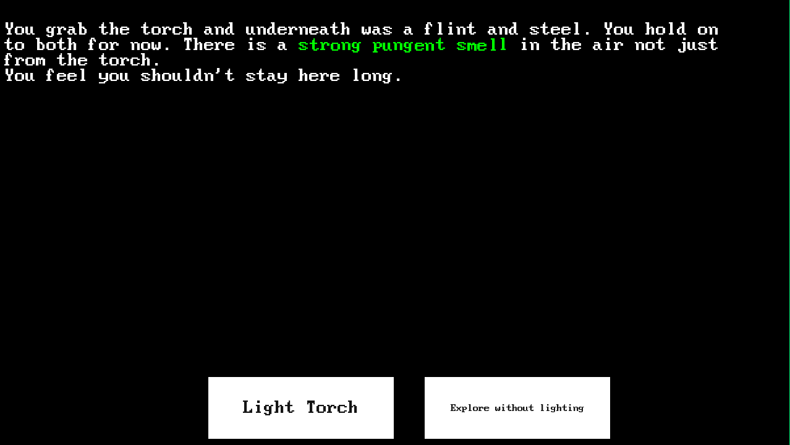

# Reflections CYOA
-choose your own adventure-
---
Reflections Choose Your Own Adventure system allows the use to play out "Choose your own adventure" style files similar to the books popular during the 90s.

---
## How-To

### Application Setup
Requirements
- Python - 3.13 + - (again used for development but this code is doing nothing fancy older python3 may still be viable)
- UV - Used for basic package management Not a hard requirement but it helps quickly set up a project
- pygame - version 2.6.1 (others may be viable but 2.6.1 was used during development)

### Launch
Download the repo, navigate via terminal to the new directory.
uv run main.py 

### CYOA File Setup
Formatting codes and configurations
Right now the file is hard coded under story_files/demo_story.txt 

#### File Setup information:

% symbol is used for sections and choices where # is used for formatting text

\[%S Section %]  defines a section which are the parts you can jump to. Between each section two returns are required "\n\n" so after the choice line an additional blank line is required. In this "Section" is the title of the section you will be able to jump to. Example \[%S Chapter2 %]

\[%C Choice1 :: Section %]\[%C Choice2 :: Section %] choices will be on the same line each choice contains the section you will jump to. Example \[%C Attack the beast :: Chapter2 %]

\[%e Ending Text %] - Signifies an end of a story branch. Endings will generate an end button which closes the application.

\[#c-255,255,255#] # inner text C-#,#,# = color setup RGB

\[#shake#] # inner text Shake = adds the jitter function to included text. AKA makes it wobbly
-button Remember to remove the shake after the section completes by running a \[#reset#]

\[#newline#] Forced newline 

\[#reset#] remove all block/formatting customizations

---
## Screenshots

## Video

---
## Third-Party Content
List of third party code/fonts and their respective licenses. These fall outside of the unlicense used by the base code of this project. If a violation is of note please file a issue here and I will address it as soon as I am able.

Font - BigBlueTerminal - https://github.com/ryanoasis/nerd-fonts/tree/master/patched-fonts/BigBlueTerminal - Creative Commons

Text Effects - pmtext - https://github.com/ChillyCider/pmtext/tree/master - WTFPLv2 license

### Known issues
- There has been a noted issue with some Desktops and Window Managers where a Focus issue triggers odd mouse/button behavior in pygame.
I believe my current implementation has fixed it but if it come back please file an issue and let me know. 
